# Diagrama de Flujo - Integraciones Artemis

```mermaid
graph TB
    %% Capa de Autenticación
    subgraph "CAPA DE AUTENTICACIÓN"
        LOGIN_DB[login_server_db.py<br/>Puerto 8090<br/>Autenticación con BD]
        LOGIN_SIMPLE[login_server.py<br/>Puerto 8080<br/>Autenticación simple]
        LOGIN_FLASK[login_app.py<br/>Puerto 8080<br/>Flask Login]
        USER_DB[(users.db<br/>SQLite)]
    end

    %% Capa Web Principal
    subgraph "CAPA WEB PRINCIPAL"
        WEB[Web Interface<br/>Puerto 5000<br/>FastAPI + Jinja2]
        API[API REST<br/>/api/*<br/>FastAPI]
    end

    %% Capa de Orquestación
    subgraph "CAPA DE ORQUESTACIÓN"
        KARTON_SYS[Karton System<br/>Coordinador de tareas]
        KARTON_DASH[Karton Dashboard<br/>Monitoreo]
        PRODUCER[Producer<br/>Creador de tareas]
        CLASSIFIER[Classifier<br/>Clasificador de targets]
    end

    %% Capa de Datos
    subgraph "CAPA DE DATOS"
        POSTGRES[(PostgreSQL<br/>Base de datos principal)]
        REDIS[(Redis<br/>Cola de tareas)]
        S3MOCK[S3Mock<br/>Almacenamiento archivos]
    end

    %% Módulos de Escaneo
    subgraph "MÓDULOS DE ESCANEO"
        PORT_SCAN[Port Scanner<br/>Escaneo de puertos]
        DNS_SCAN[DNS Scanner<br/>Análisis DNS]
        WEB_ID[Webapp Identifier<br/>Identificación web]
        NUCLEI[Nuclei<br/>Vulnerabilidades]
        BRUTER[Bruter<br/>Fuerza bruta]
        VCS[VCS Scanner<br/>Control de versiones]
        WP_SCAN[WordPress Scanner<br/>Análisis WordPress]
        JOOMLA_SCAN[Joomla Scanner<br/>Análisis Joomla]
        SQL_INJ[SQL Injection<br/>Detector]
        LFI[LFI Detector<br/>Local File Inclusion]
        SUBDOMAIN[Subdomain Enum<br/>Enumeración subdominios]
    end

    %% Capa de Reportes
    subgraph "CAPA DE REPORTES"
        AUTOREPORTER[Autoreporter<br/>Generador reportes]
        EXPORT[Export System<br/>Exportación]
        TEMPLATES[Templates<br/>Plantillas reportes]
    end

    %% Servicios de Soporte
    subgraph "SERVICIOS DE SOPORTE"
        METRICS[Metrics<br/>Prometheus]
        CLEANUP[Cleanup<br/>Limpieza automática]
        AUTOARCHIVER[Autoarchiver<br/>Archivado automático]
        LOGGER[Logger<br/>Registro de eventos]
    end

    %% Flujo de Autenticación
    LOGIN_DB --> USER_DB
    LOGIN_DB --> WEB
    LOGIN_SIMPLE --> WEB
    LOGIN_FLASK --> WEB

    %% Flujo Principal
    WEB --> API
    WEB --> PRODUCER
    PRODUCER --> CLASSIFIER
    CLASSIFIER --> KARTON_SYS

    %% Flujo de Datos
    KARTON_SYS --> REDIS
    WEB --> POSTGRES
    API --> POSTGRES
    AUTOREPORTER --> S3MOCK

    %% Flujo de Módulos
    KARTON_SYS --> PORT_SCAN
    KARTON_SYS --> DNS_SCAN
    KARTON_SYS --> WEB_ID
    KARTON_SYS --> NUCLEI
    KARTON_SYS --> BRUTER
    KARTON_SYS --> VCS
    KARTON_SYS --> WP_SCAN
    KARTON_SYS --> JOOMLA_SCAN
    KARTON_SYS --> SQL_INJ
    KARTON_SYS --> LFI
    KARTON_SYS --> SUBDOMAIN

    %% Flujo de Resultados
    PORT_SCAN --> POSTGRES
    DNS_SCAN --> POSTGRES
    WEB_ID --> POSTGRES
    NUCLEI --> POSTGRES
    BRUTER --> POSTGRES
    VCS --> POSTGRES
    WP_SCAN --> POSTGRES
    JOOMLA_SCAN --> POSTGRES
    SQL_INJ --> POSTGRES
    LFI --> POSTGRES
    SUBDOMAIN --> POSTGRES

    %% Flujo de Reportes
    POSTGRES --> AUTOREPORTER
    AUTOREPORTER --> TEMPLATES
    AUTOREPORTER --> EXPORT
    EXPORT --> WEB

    %% Servicios de Monitoreo
    KARTON_SYS --> KARTON_DASH
    KARTON_SYS --> METRICS
    KARTON_SYS --> LOGGER
    POSTGRES --> CLEANUP
    POSTGRES --> AUTOARCHIVER

    %% Estilos
    classDef auth fill:#e1f5fe
    classDef web fill:#f3e5f5
    classDef data fill:#e8f5e8
    classDef modules fill:#fff3e0
    classDef reports fill:#fce4ec
    classDef support fill:#f1f8e9

    class LOGIN_DB,LOGIN_SIMPLE,LOGIN_FLASK,USER_DB auth
    class WEB,API web
    class POSTGRES,REDIS,S3MOCK data
    class PORT_SCAN,DNS_SCAN,WEB_ID,NUCLEI,BRUTER,VCS,WP_SCAN,JOOMLA_SCAN,SQL_INJ,LFI,SUBDOMAIN modules
    class AUTOREPORTER,EXPORT,TEMPLATES reports
    class METRICS,CLEANUP,AUTOARCHIVER,LOGGER support
```

## Descripción de Componentes

### 🔐 Capa de Autenticación
- **login_server_db.py**: Servidor de login con base de datos SQLite
- **login_server.py**: Servidor de login con credenciales hardcodeadas
- **login_app.py**: Aplicación Flask para autenticación
- **users.db**: Base de datos SQLite con usuarios y permisos

### 🌐 Capa Web Principal
- **Web Interface**: Interfaz principal FastAPI en puerto 5000
- **API REST**: Endpoints API para operaciones programáticas

### ⚙️ Capa de Orquestación
- **Karton System**: Sistema de colas distribuidas para coordinar tareas
- **Producer**: Crea y distribuye tareas de escaneo
- **Classifier**: Clasifica targets (dominios, IPs, rangos)

### 💾 Capa de Datos
- **PostgreSQL**: Base de datos principal para resultados
- **Redis**: Cola de tareas y cache
- **S3Mock**: Almacenamiento de archivos y reportes

### 🔍 Módulos de Escaneo
- **Port Scanner**: Escaneo de puertos abiertos
- **DNS Scanner**: Análisis de configuración DNS
- **Nuclei**: Detección de vulnerabilidades conocidas
- **WordPress/Joomla Scanners**: Análisis específico de CMS
- **SQL Injection/LFI Detectors**: Detección de vulnerabilidades web

### 📊 Capa de Reportes
- **Autoreporter**: Generación automática de reportes
- **Export System**: Sistema de exportación en múltiples formatos
- **Templates**: Plantillas para reportes personalizados

### 🛠️ Servicios de Soporte
- **Metrics**: Métricas Prometheus para monitoreo
- **Cleanup**: Limpieza automática de datos antiguos
- **Autoarchiver**: Archivado automático de resultados
- **Logger**: Sistema de logging centralizado

## Flujo de Trabajo

1. **Autenticación**: Usuario se autentica via login_server_db.py
2. **Acceso Web**: Redirección a interfaz principal (puerto 5000)
3. **Creación de Tareas**: Usuario crea escaneos via web o API
4. **Clasificación**: Classifier procesa y categoriza targets
5. **Distribución**: Karton System distribuye tareas a módulos
6. **Ejecución**: Módulos ejecutan escaneos específicos
7. **Almacenamiento**: Resultados se guardan en PostgreSQL
8. **Reportes**: Autoreporter genera reportes automáticamente
9. **Exportación**: Usuario puede exportar resultados
10. **Monitoreo**: Métricas y logs para seguimiento del sistema